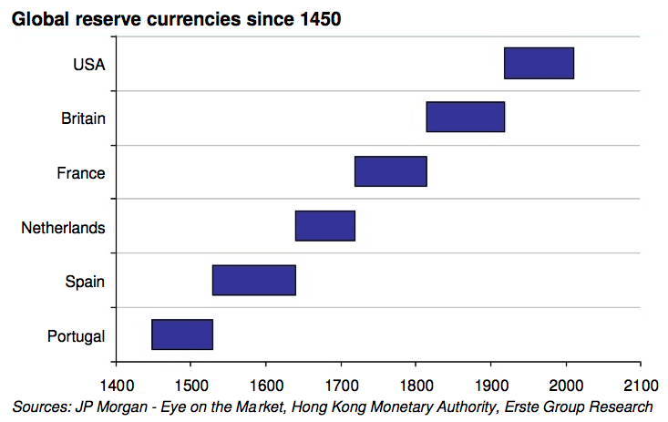
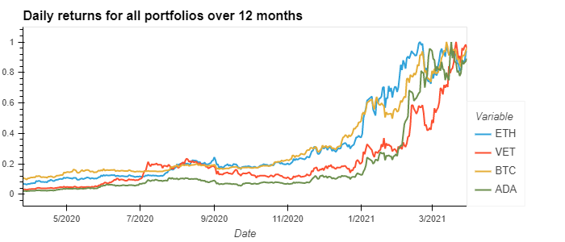
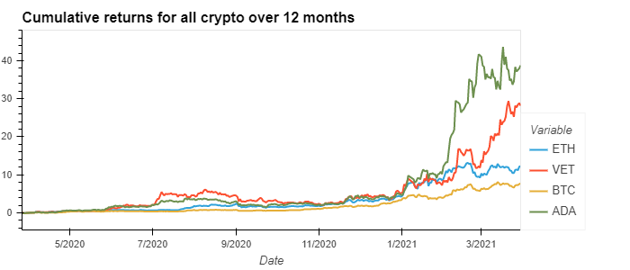
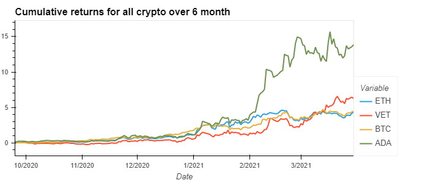
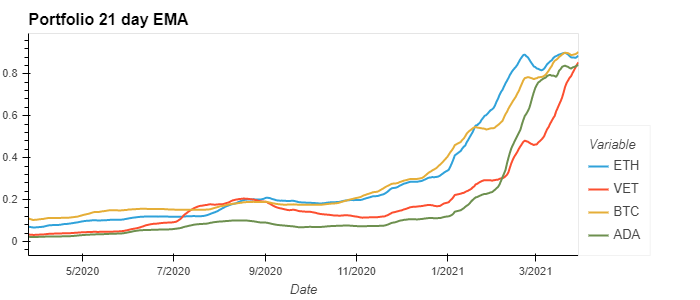
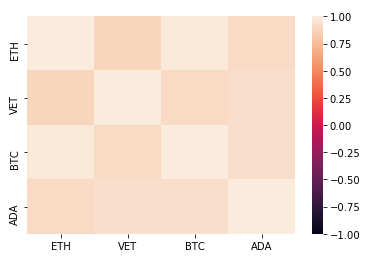
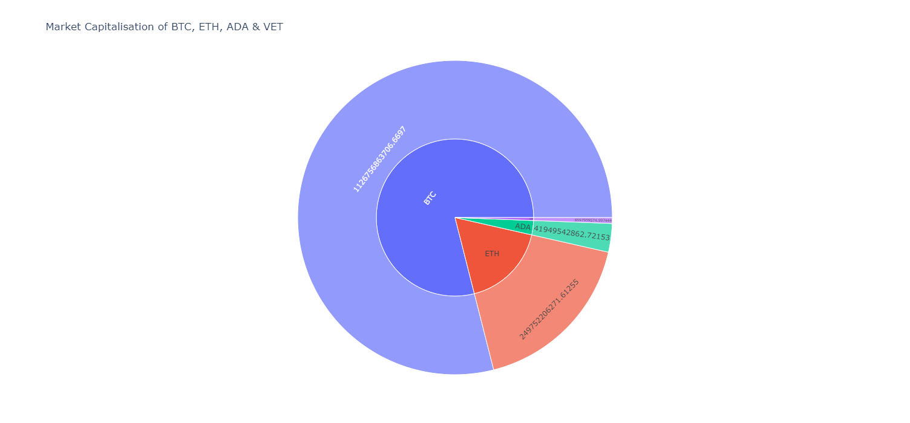

# project1
Group name: The four 'Musk'eteers

# Motivation
Bitcoin and Crytocurrency have evolved over the years, and is showing signs of a market cycle with boom and bust periods.

A brief timeline of Bitcoin can be summarised as followed.  
2009: Creation of Bitcoin post Global Financial Crisis  
2013: Early Innovators  
2017: Individual Investors (Bull market 1)  
2020: Institutions buying in (Bull makret 2)

The terms Bitcoin, crytocurrency and blockchain are sometimes used interchangeably. This is a misnomer. Bitcoin is a type of crytoccurency running on it's own blockchain. However there are many coins, tokens, protocols, blockchains, decentralised finance projects in the cryptocurrency ecosystem.

At the time of producing this article (April 2021), cryptocurrency is currently in a bull market.

There are many reasons to be bullish.
Bitcoin has gone mainstream and now is too big to ignore.
After all, it is the best performing asset of the last decade. (1)  
During a congressional hearing on Cryptocurrencis, US Congressman Patrick McHenry stated that he expects Bitcoin to have tremendous value and utility over the long term. (2)  
Some people believe a combination of money printing and low, negative interest rates will cause traditional currencies like the USD to lose its global reserve currency status. Will Bitcoin become the next monetary base?

Controversy is never far from Bitcoin. A combination of Cryptocurrency (Mt Gox etc) exchange hacks, lost passwords, scams, online anonymised drug marketplaces (Silk Road) sure make a telling drama.

Nonetheless, the world is waking up to Bitcoin. Billionaires like Elon Musk, Michael Saylor, Paul Tudor Jones, Jack Dorsey, Chamath Palihapitiya, Nassim Taleb, Peter Thiel, Raoul Paul, and Naval Ravikant have already embraced Bitcoin. Is this just the beggining?

# Hypothesis
Bitcoin is synonymous with Cryptocurrency, being the first and most widespread. In pop culture, Bitcion would be referred to as the OG (Original Gangster). Most people have heard of Bitcoin. Fewer people have heard of Altcoins (Alternate coins).

Our focus is on 4 coins/tokens: Bitcoin BTC, Ethereum ETH, Cardano ADA, Vechain VET.

Our hypothesis is that there is a relationship between the prices of various cryptocurrencies, measured in USD, with ETH lagging BTC by 6 days.

If there is a correlation between the various cryptocurrencies, then perhaps timing entries and exits would give us an edge in trading.

# Data Collection
3 years of historical data was used, obtained from au.investing.com.  
We created a python file (reader.py) which imports the CSV, drops the Open, High, Low, Vol, Change % columns, and returns the CSV as a dataframe.  
4 dataframes were concatenated into a single main dataframe (daily_returns).

# Analysis
Daily returns were calculated over 12, 6 and 3 months.
Due to the wide variation in prices, plotting the daily returns in a graph would result in unreadeble content visually.
In order to counteract this problem, the returns were normalised to a value between 0 and 1. Graph were then plotted based on this ratio.

The next step in analysis was to calculate cumulative returns.
Percentage returns were calculated, nulls dropped, and graphs plotted.

Rolling 21 day standard deviation for all portfolios were calculated

21 EMA was calculated  
This is an indicator which gives more weighting or importance to recent price data. (3)

Correlations were calculated using a matrix and heatmap.
This is over 12 months.

From the correlations, the Sharpe ratios were plotted.
365 trading days were used rather than the traditional 252 trading days, as cryptocurrency trades 24/7.  
Sharpe Ratios above 1.00 are considered 'good', suggesting the portfolio is offering excess returns relative to volatility.  
For crypto to have a Sharp ratio of between 13 and 25 in our examples, it cannot be compared to traditional hedge funds.
You need to compare between cryptos and not between different types of assets.

To test our hypothesis, we calculated the shift in ETH, ADA, VET closing price over a period of -14 to +14 days.  
We aimed to find out if correlation changed, possibly giving us an insight into when to enter/exit positions.  
Over 12 months, maximum Correlation of ETH to BTC is 0.9828 for period shift of 0 days  
Over 3 months, maximum Correlation of ETH to BTC is 0.8626 for period shift of 0 days  
Over 12 months, maximum Correlation of ADA to BTC is 0.9482 for period shift of -8 days  
Over 3 months, maximum Correlation of ADA to BTC is 0.9285 for period shift of 0 days  
Over 12 months, maximum Correlation of VET to BTC is 0.9223 for period shift of -10 days  
Over 3 months, maximum Correlation of VET to BTC is 0.89 for period shift of 0 days  

We plotted the market capilisation using Coin Market Cap API.  
A GET request was performed, which returned data in JSON format.  
Market cap was retrieved, added into a dataframe, and a sunburst plot was created.

# Limitations
This project was limited to our current skill set.
We think 'Time series analysis' could be useful, but we have not learnt to use that yet.

# Problems Faced
CSV vs API  
During reasearch, it was difficult to find a free API which returned historical cryptocurrency data.
There was data access issues with limitation of free software.
Resorted to using a CSV instead.

During git pushing, our main.ipynb file was written over.
Luckily we had a backup.
Although working with various branches sounds simple in theory, in practice it was frustrating.
Syntax errors were common and often out of our scope of knowledge.

We were using USD as a base.  
In this instance, we are assuming USD is the same as USDT (Tether pair), pegged 1:1.
When trading, some people would choose to trade the BTC pair, instead of the USDT pair.  
If we tweaked our project to use BTC as a base, for example using VET/BTC rather than VET/USDT, the results might be different.  
Certainly one aspect of this project to delve into, possibly when dealing with trading algorithms.

Time limits were stretched with only 2 weeks to produce findings.
We did a holistic overview rather than more detailed analysis.

We were working within our scope of knowledge.
Our analysis would probably be different from what a professional hedge fund manager would do.
We could also have tested this hypothesis on more coins.

We did not have time to verify whether our CSV data from au.investing.com was correct.

Mac vs PC formatting issues.

# Conclusion
Our hypothesis was that BTC leads the market, followed by ETH then ADA & VET.

However, our data and calculations did not support the hypothesis.

Over 3 months, correlation of ETH/ADA/VET compared to BTC were all highest on day 0.
Buying on the same day would lead to similar price action.

Over 12 months, maximum correlation between ETH/BTC is on day 0.
However, it would be better to have bought BTC 8 days after ADA, and 10 days after Vechain!

Using ADA as an example.
ADA had the highest standard deviation, lowest Sharpe Ratios, but gave highest returns.
Potential for massive gains, but high risk tolerance needed!

1. https://finance.yahoo.com/news/bitcoin-becomes-best-performing-asset-132208120.html#:~:text=(%2D0.77%25)-,Bitcoin%20Becomes%20Best%20Performing%20Asset%20Of%20The%20Decade%2C%20Returning,Times%20More%20Than%20Nasdaq%20100&text=After%20its%20recent%20surge%20to,of%20230%25%2C%20data%20shows.

2. https://www.forbes.com/sites/ktorpey/2019/10/24/this-us-congressman-thinks-bitcoin-will-have-enormous-value-and-utility-over-the-long-term/?sh=2e1db45e278e

3. https://www.investopedia.com/ask/answers/122314/what-exponential-moving-average-ema-formula-and-how-ema-calculated.asp#:~:text=The%20exponential%20moving%20average%20(EMA)%20is%20a%20technical%20chart%20indicator,importance%20to%20recent%20price%20data.